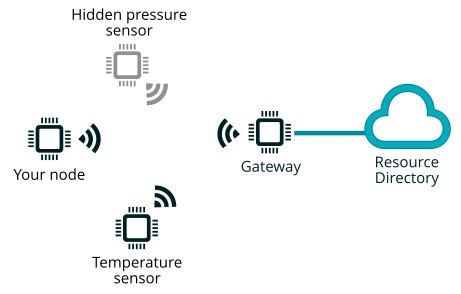

# CoAP basic example

The Constrained Application Protocol (CoAP) is a specialized web transfer
protocol for use with constrained nodes and constrained (e.g., low-power, lossy)
networks. It has been standardized by the IETF in
[RFC 7252](https://datatracker.ietf.org/doc/html/rfc7252).

Nodes can act both as clients (performing requests) and as servers (serving
requests). In this example the node will expose one resource at `/riot/board`,
which accepts GET requests and returns the board name in plain text.

It also can perform CoAP requests to other nodes. The application exposes a
`coap` shell command to interact with these functionalities.

We will be using the gcoap module from RIOT. For more detailed information and
advanced usages, check
[the documentation](https://doc.riot-os.org/group__net__gcoap.html).

## Task 1

Verify that your device is exposing the resource correctly.

**1. Build and flash the application. Open a serial communication:**
```sh
$ make all flash term
```

**2. On the RIOT shell, find your node IPv6 address by using the `ifconfig` command:**
```sh
> ifconfig
```

**The response should be similar to:**
```
2022-03-30 13:51:14,836 # ifconfig
2022-03-30 13:51:14,840 # Iface  6  HWaddr: 3E:66  Channel: 26  NID: 0x23 
2022-03-30 13:51:14,844 #           Long HWaddr: 5F:0F:7B:9D:AE:49:3E:E6 
2022-03-30 13:51:14,848 #            TX-Power: 0dBm  State: IDLE 
2022-03-30 13:51:14,851 #           AUTOACK  ACK_REQ  AUTOCCA  
2022-03-30 13:51:14,856 #           L2-PDU:102  MTU:1280  HL:64  6LO  IPHC  
2022-03-30 13:51:14,859 #           Source address length: 8
2022-03-30 13:51:14,862 #           Link type: wireless
2022-03-30 13:51:14,867 #           inet6 addr: fe80::5d0f:7b9d:ae49:3ee6  scope: link  VAL
2022-03-30 13:51:14,874 #           inet6 addr: 2001:db8::5d0f:7b9d:ae49:3ee6  scope: global  VAL
2022-03-30 13:51:14,876 #           inet6 group: ff02::1
2022-03-30 13:51:14,877 #   
```

**You should see one wireless interface.**
**Among other things, it has a MAC address (Long HWaddr), a maximum transmission unit (MTU) and one or more IPv6 addresses.**
**They are denoted `inet6 addr`. You may not see the one with `scope:global`.**
**In this case, one of the node's IPv6 addresseterms is `2001:db8::5d0f:7b9d:ae49:3ee6`.**

**3. Make a coap GET request to your own node. Use your IP address from the previous step.**
**You can check how to use the `coap` shell command by typing:**
```sh
> coap help
```

**The default UDP port for CoAP servers is `5683`:**
```sh
> coap get 2001:db8::5d0f:7b9d:ae49:3ee6 5683 /.well-known/core
coap get 2001:db8::d08e:7060:6eff:7da6 5683 /.well-known/core
```

**You should get a response with `code 2.05` and the paths of the resources.**
```
2022-03-30 19:44:17,534 # gcoap_cli: sending msg ID 37913, 23 bytes
2022-03-30 19:44:17,539 # gcoap: response Success, code 2.05, 13 bytes
2022-03-30 19:44:17,540 # </riot/board>
```

**4. Try to get the board name from the `/riot/board` resource, sending a GET request.**
**The command should look almost as the one in step 3, but with a different path at the end.**
coap get 2001:db8::d08e:7060:6eff:7da6 5683 /.riot/board


## Task 2

Add a new CoAP resource to the server to interact with LEDs on the board. Upon a
GET request it should return the status of the specific LED. When a PUT request
is received, the payload should used to set the new status of the LED.

**NOTE: The CoAP server is implemented in `server.c`, that's where you are going**
**to work.**

**1. Declare an array of GPIOs to control the LEDs:**
```C
static const gpio_t leds[] = {
    LED0_PIN,
    LED1_PIN,
    LED2_PIN,
};
```
**2. Initialize the LED GPIOs inside the `server_init` function.**
```C
/* initialize LEDs and turn them off */
for (unsigned i = 0; i < ARRAY_SIZE(leds); i++) {
    gpio_init(leds[i], GPIO_OUT);
    gpio_set(leds[i]);
}
```

**3. Register a new CoAP resource in the `_resources` array.**
**It should accept GET and PUT requests.**
**It should also match all requests to paths starting with `/led/`:**
```C
{ "/led/", COAP_GET | COAP_PUT | COAP_MATCH_SUBTREE, _led_handler, NULL },
```

**4. Implement the resource handler function.**

**Start by defining the function with the correct**
**[signature](https://doc.riot-os.org/group__net__gcoap.html#ga8f62887693fa63a7595565e44156806d):**
```C
static ssize_t _led_handler(coap_pkt_t *pdu, uint8_t *buf, size_t len, void *ctx)
{
    (void) ctx; /* argument not used */

    /* implement your handler here */

    return 0;
}
```

**First we need to parse the URI, to know which LED was requested:**
```C
char uri[CONFIG_NANOCOAP_URI_MAX] = { 0 };
/* get the request path, to know which LED is being requested */
if (coap_get_uri_path(pdu, (uint8_t *)uri) <= 0) {
    /* reply with an error if we could not parse the URI */
    return gcoap_response(pdu, buf, len, COAP_CODE_BAD_REQUEST);
}

/* find the LED number, the URI should be /led/<number> */
char *led_str = uri + strlen("/led/");
unsigned led_number = atoi(led_str);

/* verify that the number is valid, respond with an error otherwise */
if (led_number >= ARRAY_SIZE(leds)) {
    return gcoap_response(pdu, buf, len, COAP_CODE_BAD_REQUEST);
}
```

**Now we need to determine the type of request (GET or PUT):**
```C
ssize_t resp_len = 0;
int led_status = 0;
unsigned method = coap_method2flag(coap_get_code_detail(pdu));

switch (method) {
case COAP_PUT: /* on PUT, we set the status of the LED based on the payload */

case COAP_GET: /* on GET, we return the status of the LED in plain text */

}
```

**Let's implement the PUT request first:**
```C
case COAP_PUT: /* on PUT, we set the status of the LED based on the payload */
    /* check if there is a payload with a LED status */
    if (pdu->payload_len) {
        led_status = atoi((char *)pdu->payload);
    } else {
        return gcoap_response(pdu, buf, len, COAP_CODE_BAD_REQUEST);
    }

    if (led_status) {
        gpio_clear(leds[led_number]);
    } else {
        gpio_set(leds[led_number]);
    }
    return gcoap_response(pdu, buf, len, COAP_CODE_CHANGED);

```

**Now the response to a GET request:**
```C
case COAP_GET: /* on GET, we return the status of the LED in plain text */
    /* initialize the CoAP response */
    gcoap_resp_init(pdu, buf, len, COAP_CODE_CONTENT);

    /* set the content format to plain text */
    coap_opt_add_format(pdu, COAP_FORMAT_TEXT);

    /* finish the options indicating that we will include a payload */
    resp_len = coap_opt_finish(pdu, COAP_OPT_FINISH_PAYLOAD);

    /* get the current status of the LED, which is the inverted value of the GPIO */
    led_status = !gpio_read(leds[led_number]);

    /* based on the status, write the value of the payload to send */
    if (led_status) {
        pdu->payload[0] = '1';
    } else {
        pdu->payload[0] = '0';
    }
    resp_len++;
    return resp_len;
```

**5. Declare your handler function's prototype before `_resources` is declared:**
```C
static ssize_t _led_handler(coap_pkt_t *pdu, uint8_t *buf, size_t len, void *ctx);
```

**6. Build and flash your application. Open the serial communication.**

You should be able to interact with your own LEDs by sending messages to your
own IP address (`coap put`)...but that's not fun...

## Task 3

Ask someone around for their IP address and try to turn some other board's LEDs
on.

**1. Turn the LED 0 of some other board on:**
```sh
> coap put 2001:db8::814c:35fc:fd31:5fde 5683 /led/0 1

coap put 2001:db8::d08e:7060:6eff:7da6 5683 /led/0 1
```
---

## CoRE Link Format (RFC 6690)

[RFC 6690](https://datatracker.ietf.org/doc/html/rfc6690) defines a format to
express web linking for constrained nodes. It is usually utilized for resource
discovery (e.g. via the `/.well-known/core` resource or a resource directory).

Let's see an example of a link format response (the line breaks are included 
for clarity):

```
</sensors>;ct=40;title="Sensor Index",
</sensors/temp>;rt="temperature-c";if="sensor",
<coap://[fd00:dead:beef::1]/sensors/light>;rt="light-lux";if="sensor";obs
```

This list of links contains 3 elements. Link in a list are separated by `,`. A
link is composed by a URI (enclosed in `< >`) and zero or more attributes. Each
attribute is separated by `;`. An attribute may or may not have a value. The key
and the value are separated by `=`. Attributes are key/values, expressing extra
information about the link. Some examples of attributes are: content type
(`ct`), resource type (`rt`), or the interface (`if`).

---

**The next two tasks involve multiple nodes and a resource directory. The**
**complete diagram looks like the following:**



## Task 4

Use the information from the `/.well-known/core` to find resources exposing
temperature and humidity readings of the room.

**1. Using the provided IP address, perform a GET request to the nodes**
**`/.well-known/core` resource to find which resources it exposes.**
**Use the `coap` shell command as in task 1.**

coap get 2001:db8::4860:3c76:8f4b:16e6 5683 /.well-known/core

**2. Once you have found the resources, try getting the current temperature**
**and humidity values.**

## Task 5

Discover the hidden sensor. Perform a lookup on a resource directory to find a
node that is exposing pressure and magnetic readings in the room.

**1. Using the provided resource directory IP address, perform a GET request to**
**its `/.well-known/core` resource. The response will be in Link Format.**
**You need to find in the list of links, a resource where to perform a lookup.**
**According to the specification, the resource type of the lookup resource**
**should be `rt=core.rd-lookup-res`**

coap get fd00:dead:beef::1 5683 /.well-known/core

**2. Once you have found the lookup resource, perform a GET request to it.**
**It should reply with the hidden sensor information.**

**3. Finally, get the current pressure and magnetic values from the hidden sensor.**

## Task 6

Make a pull request on GitHub with your changes.

**1. Make sure you saved all changes. Switch to a new git branch:**
```sh
$ git checkout -b pr/add_my_sensors
```

**2. Configure your name and email, replace with your information:**
```sh
$ git config --global user.name "FIRST_NAME LAST_NAME"
$ git config --global user.email "MY_NAME@example.com"
```

**3. Stage your changes to be committed:**
```sh
$ git add .
```

**4. Add a new commit with the change. Adapt the commit message with your name:**
```sh
$ git commit -m "Add sensor CoAP resources"
```

**5. Make a fork of [the project](https://github.com/smartuni/exercises)**
**on your own account, using GitHub's website.**

**6. Add the new remote to your repository. Replace with the correct username**
```sh
$ git remote add upstream https://github.com/<your_username>/exercises.git
```

**7. You will need to generate a token to login while you push your changes.**
**Generate a new token following**
**[this guide](https://docs.github.com/en/authentication/keeping-your-account-and-data-secure/creating-a-personal-access-token). COPY IT SOMEWHERE!**

**7. Push the new branch to your repository:**
```sh
$ git push upstream pr/add_my_sensors
```
**When prompted for a password, use your token.**

**8. Create a new ull request using GitHub website**
